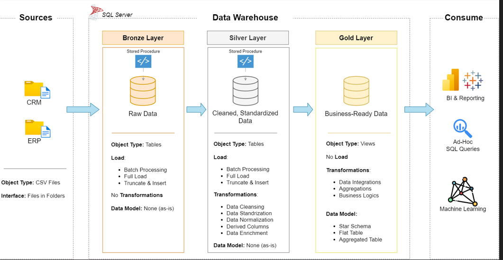

# Data Warehouse Project and Analytics Project 
---
Welcome to the **Data Warehouse and Analytics Project** repository! 🚀  
In this project, I built a complete data warehousing and analytics solution—from designing and creating the data warehouse to generating meaningful and actionable insights from the data.

Through this project, I applied industry best practices used in data engineering and analytics, including data organization, transformation, and analysis. The goal of this work was to demonstrate my ability to build a structured data warehouse and use it to support data-driven decision-making.

This project is part of my portfolio and reflects my practical skills in data engineering, data warehousing, and analytics.
***

---
## 🏗️ Data Architecture

The data architecture for this project follows Medallion Architecture **Bronze**, **Silver**, and **Gold** layers:


1. **Bronze Layer**: Stores raw data as-is from the source systems. Data is ingested from CSV Files into SQL Server Database.
2. **Silver Layer**: This layer includes data cleansing, standardization, and normalization processes to prepare data for analysis.
3. **Gold Layer**: Houses business-ready data modeled into a star schema required for reporting and analytics.

---
## 📖 Project Overview

This project involves:

1. **Data Architecture**: Designing a Modern Data Warehouse Using Medallion Architecture **Bronze**, **Silver**, and **Gold** layers.
2. **ETL Pipelines**: Extracting, transforming, and loading data from source systems into the warehouse.
3. **Data Modeling**: Developing fact and dimension tables optimized for analytical queries.
4. **Analytics & Reporting**: Creating SQL-based reports and dashboards for actionable insights.

🎯This repository showcases my skills and practical experience in several key areas of data and analytics, including:

* SQL Development for querying and managing data efficiently
* Data Architecture concepts used in designing structured data systems
* Data Engineering techniques for building reliable data workflows
* ETL Pipeline Development for extracting, transforming, and loading data into a data warehouse
* Data Modeling to organize and structure data for analysis
* Data Analytics to generate meaningful insights and support data-driven decision making

This project demonstrates my ability to work across different stages of the data lifecycle, from data preparation and storage to analysis and insight generation.
 

---


## 🚀 Project Requirements

### Building the Data Warehouse (Data Engineering) 

#### Objective 
Develop a modern data warehouse using SQL Server to consolidate sales data, enabling analytical reporting and informed decision-making.  

#### Project Specifications 

- **Data Sources**: I imported data from two different source systems, ERP and CRM, which were provided as CSV files.  
- **Data Quality**: I cleaned and transformed the data to resolve data quality issues before performing analysis.
- **Integration**: I combined data from both sources into a single, well-structured data model optimized for analytical queries.
- **Scope**: The project focuses only on the latest available dataset, and historical data tracking (historization) was not included in this implementation.
- **Documentation**: I documented the data model clearly so that both business stakeholders and analytics teams can easily understand and use the data structure.

---


## 📂 Repository Structure
```
data-warehouse-project/
│
├── datasets/                           # Raw datasets used for the project (ERP and CRM data)
│
├── docs/                               # Project documentation and architecture details
│   ├── data_architecture.png           # File shows the project's architecture
│   ├── data_catalog.md                 # Catalog of datasets, including field descriptions and metadata
│   ├── data_flow.png                   # File for the data flow diagram
│   ├── data_integration.png            # File illustrating the data integration process between source systems and the data warehouse
│   ├── data_models.png                 # File for data models (star schema)
│   ├── naming-conventions.md           # Consistent naming guidelines for tables, columns, and files
│
├── scripts/                            # SQL scripts for ETL and transformations
│   ├── bronze/                         # Scripts for extracting and loading raw data
│   ├── silver/                         # Scripts for cleaning and transforming data
│   ├── gold/                           # Scripts for creating analytical models
│
├── tests/                              # Test scripts and quality files
│
├── README.md                           # Project overview and instructions
```
---

---

## 🌟 About Me

Hi there! I'm **Sonia**, I “Transforming raw data into meaningful insights through analytics and data warehousing.”
